# 古今漢字

為了讓漢字形體的演變和對比更加直觀，我會仔細地列舉「馬」字的在不同歷史時期的形體進行分析。

## 古漢字形體的演變——從甲骨文到小篆

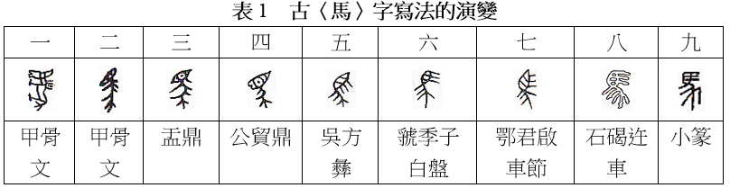

### 甲骨文

晚商王室用龜甲獸骨來占卜，之後或會命人把卜辭用刀刻寫出來，甲骨文就是指這些刻寫在甲骨上的古漢字。甲骨文的字形較為豎長，一般是從上到下閲讀，字和字之間的界限頗為分明。下面展示一段甲骨文的例子。這段文字約於公元前十三世紀刻寫在一塊用作占卜的龜腹甲上。

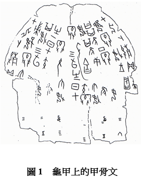

甲骨文可以跟另外兩種原創性的文字―蘇美爾文和古埃及文，在形體上作一比較。早期的蘇美爾文，刻寫在小泥板上，頗為象形，一般亦屬豎長型，主要用來記帳。後來為了書寫方便快捷，很快由刻寫轉為壓寫，筆劃變成直線。在小泥板上壓寫楔形文字，很難寫出像甲骨文那樣繁複而又清晰易辨的文字。古埃及文的碑銘體則像圖畫一樣，比甲骨文更象形，雕工更為精緻，但這樣精美的文字，需要用很多時間來雕寫。甲骨文比蘇美爾的楔形文字細緻，而比古埃及文的碑銘體便捷。

商朝中期的銅器銘文和商末的甲骨文，是迄今已發現的最古老漢字。商朝中期的銅器銘文只有零星的發現，要研究古漢字的發展只能從晚商的甲骨文開始。甲骨文使用歷時將近兩百年，有四千多個不同的單字，對研究古漢字寫法的演變有很大的幫助。

説了怎麽多介紹，我們來看一看表 1 中第一個甲骨文的「馬」字：

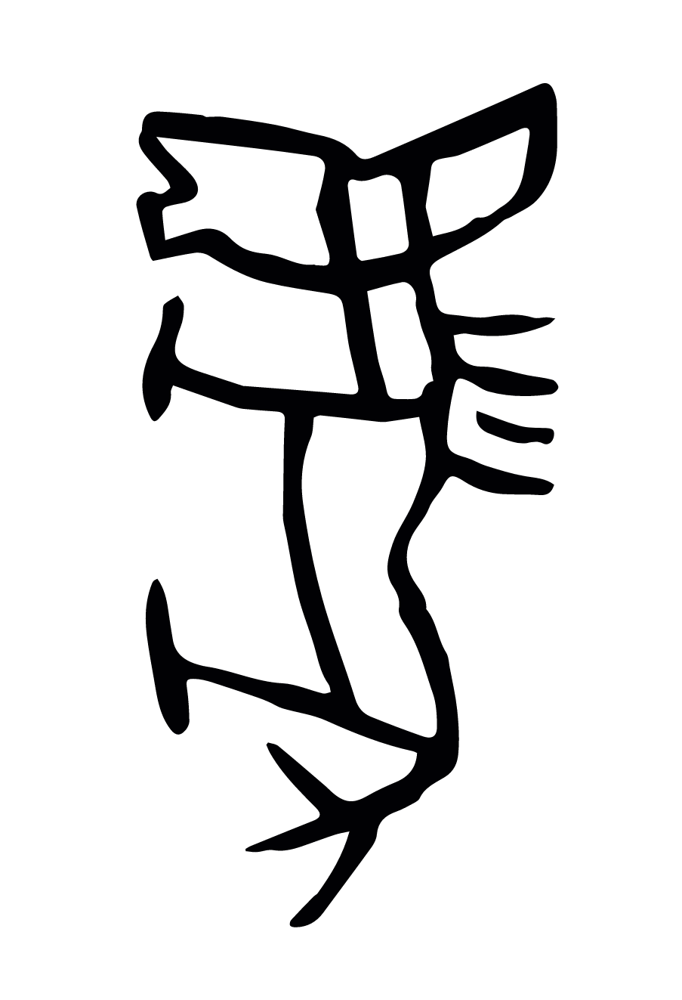

我們來把這個「馬」字的各個部件標明一下：

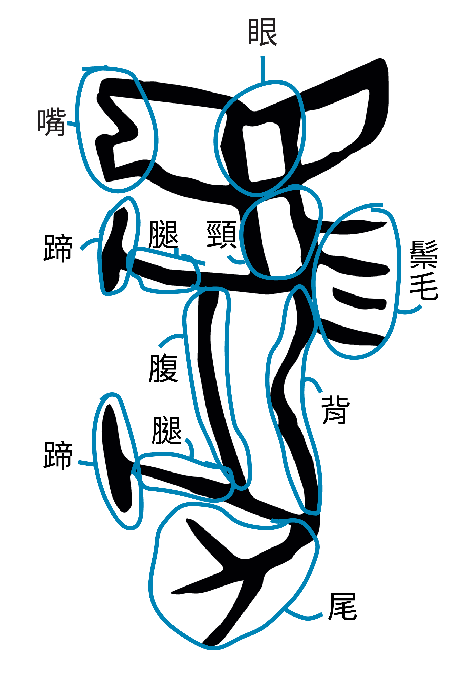

因為從上到下書寫，馬身直置，字形豎長，顯示出馬的頭、眼、嘴、頸、鬃毛、背、腹、蹄、尾。除了「馬」豎立而不是正常的橫置之外，甲骨文的「馬」像一幅馬的圖畫，非常傳神。

還好商朝人把馬順時針轉了90度，而不是逆時針。。。

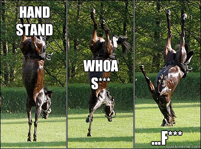

但也因為像圖畫，所以不同人寫出來的「馬」字有一些差別：

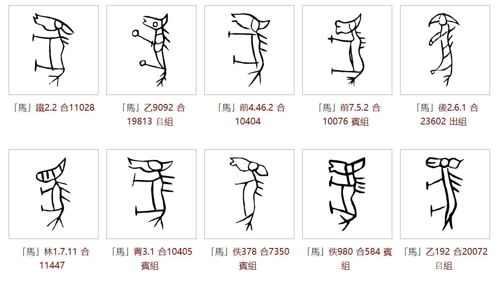

由於該字形繁複，不便書寫，當文字應用頻繁時，字形會趨向簡化：

我們來把這個「馬」字的各個部件的變化標明一下：

到了甲骨文後期，馬的背、腹合寫，脖子、背腹、馬尾用一條直線串連起來，馬尾毛仍保持散開的三义形，鬃毛由四根變成三根，兩隻馬腳省去蹄部，頭形簡化，嘴部消失，看起來既似馬頭，又似馬目。整個字寫起來比表 1 中第一個字（上一個字）稍為便捷。

### 金文

金文是指上起商周、下迄春秋戰國的銅器銘文，歷史長達一千二百多年。商朝中期已出現了零星的金文，到西周時，金文大盛。商朝和西周的金文，跟甲骨文同出一源，所以兩者的字形結構基本上是一樣的，但金文的字形更為工整，筆劃亦較為粗壯圓潤。

#### 西周早期

早期金文的「馬」字，寫法很接近末期的甲骨文，例如公元前十世紀初刻於盂鼎那個「馬」字（見表 1 中第三個字）：

我們來把這個「馬」字的各個部件的變化標明一下：

馬首部分變成眼睛，眼珠中間多了一個小點，表示這部分是眼珠。馬身和兩隻馬腳只用兩筆寫成，三根鬃毛分佈在馬首和馬身上。散開的馬尾毛，以三叉形顯示其特徵。馬首部分變成眼睛，相信是因為很多人把馬首簡化的字形看作是眼睛。

#### 西周中期

西周中期金文有一個「馬」字，刻於公貿鼎（見表 1 中第四個字）：

我們來把這個「馬」字的各個部件的變化標明一下：

這個西周中期的「馬」字清楚顯示馬嘴，表示這是頭部，而不是眼睛。簡化後的馬首，形狀變得模棱兩可，雖然有人仍看出是馬首，但多數人看作是眼睛。大眼睛並不是馬首的特徵，長馬面才是，但大眼睛的寫法成為主流。由此可見，象形字過於簡化，會容易引起誤解。

西周中期有另一個「馬」字，刻於吳方彝[^2]（見表 1 中第五個字）：

[^2]: 彝：讀作yí，古代盛酒的器具，亦泛指古代宗廟常用的祭器。

我們來把這個「馬」字的各個部件的變化標明一下：

字形的象形程度已減弱， 馬的眼珠用兩條橫線寫成，取代圓形的眼珠，馬腳和馬尾連成字的下部，寫法進一步簡化，書寫更為便捷。但三條鬃毛跟欖形的眼睛，仍然可以分辨開來。從字的結構來看筆劃的順序，應該是先寫眼睛，然後再寫鬃毛。當人們習慣這種寫法後，有些人便想到可以將馬的眼珠跟鬃毛連成直線，令到寫法更為便捷。

#### 西周晚期

到了西周晚年，發展了二百多年的西周金文，形狀已起了頗大的變化，筆劃趨向線條化和平直化，象形程度進一步減弱。例如公元前九世紀末年刻於虢[^1]

[^1]: 虢：讀作guó，周代國名。有東、西、南、北四虢。

季子白盤那個「馬」字（見表 1 中第六個字）：

我們來把這個「馬」字的各個部件的變化標明一下：

這個西周晚年的「馬」字筆劃已線條化和平直化，馬目跟三根鬃毛，已連成三條直線，但馬目跟鬃毛連寫，眼睛的形狀變得較難辨認。

其實長髮飄飄也不是想象中的那麽美好。。。

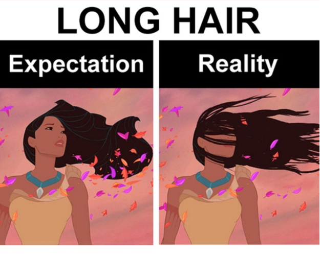

馬尾和馬腳組成字的下部，但因裝字關係，彼此的大小不成比例。

#### 春秋戰國

公元前四世紀末年戰國時期，楚國鄂君啟車節刻有一個金文「馬」字（見表 1 中第七個字）：

這個字比表 1 中第六個字晚約五百年，但寫法卻更為保守，更為接近西周中期的「馬」字（見表 1 中第五個字）。

楚國金文的字體比較古老，可能是由於楚國位處邊陲，正規文字的發展比周室京都緩慢。戰國時期，各個國家都有自己的一套承襲自周朝金文的漢字寫法，統稱為戰國文字。這裏因為其種類繁多，寫法與金文有較大差異就不深入討論。

### 大篆

周平王東遷後，位處於西周故地的秦國，繼承了西周晚年的籀文，發展成大篆。大篆是秦國的官方文字，春秋戰國時期在秦國使用，與六國的文字有別，字體相當工整，大小劃一。大篆承接西周晚年的文字，與商代的甲骨文和西周的金文，可以說是一脈相承的。大篆的字體相當穩定，經歷了五、六百年，變化仍然很少。

戰國時期，秦國的石碣迕車刻有「馬」字（見表 1 中第八個字）：

這個「馬」字，跟西周晚年虢季子白盤金文的「馬」字（見表 1 中第六個字）寫法相當接近。

石刻「馬」字莊重典雅，注重字的佈局，空間利用得宜。

### 小篆

公元前 221 年，秦統一全國。由於各地的文字異形，秦始皇規定全國使用秦國的文字，以使政令能下達各地，因此命李斯整理大篆。整理後的篆書就稱為小篆。《說文解字》中載有一個小篆的「馬」字：

大篆和小篆基本上相同，例如大篆和小篆的「馬」字，分別可見於石碣迕車（表 1 中第八個字）和《說文解字》（表 1 中第九個字）：

相比之下，小篆的馬目沒有大篆那樣象形，馬尾因佈局關係而揚起，其餘分別不大。但一般來說，大篆的筆劃輕重、粗細不一；而小篆的筆劃則變得線條化，一律屬於瘦筆。此外，小篆的偏旁有固定的寫法和位置，字體亦更為工整。西周的金文，經過大篆，發展成小篆。

## 今漢字形體的演變——從隸書到楷書

### 隸書

談隸書應該從秦隸開始。秦隸是由秦國大篆的草書體演變而成的。大篆是秦國的正規文字，字體易於識別，但寫時要較用心和費時，適合隆重和嚴肅的場合使用。民間一般則會用上大篆草體，用毛筆書寫在竹簡或木簡上，以求便捷。戰國末年，秦國官獄的文書工作大增，獄吏日常需要在竹簡上大量書寫，不得不求快求簡，自然會用上民間便捷的字體。篆書中的弧線被直線取代，字體變得更為簡約。秦國的獄吏，稱為徒隸，他們所用的書體，就稱為秦隸。

想象一下用小篆寫作業的感受，我就😱😭😭😭。感謝獄卒大哥們🙏🙏🙏

現以睡虎地秦簡〈馬〉字來顯示秦隸的寫法：

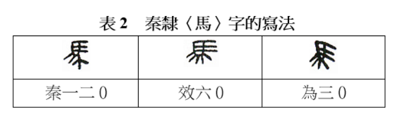

跟篆書比較，秦隸筆劃趨向簡化，但仍未有統一的寫法。秦始皇日理萬機，需要大量閱讀，應當深切明白文字寫法要統一，才便於閱讀。他在統一全國後，命程邈整理秦隸。整理後的秦隸，是輔佐篆書的字體。這種字體由於書寫簡捷，在西漢時越來越盛行，終於取代了小篆，成為正規字體，字形方正微長。這種隸書到了西漢中期，字體變成扁寛。東漢中期，隸書越趨成熟，到東漢晚期，字體呈正方形。這種方塊隸書，成為標準的字體，又稱為八分，表示字的高度只及小篆的八分。

隸書由豎、橫、點、撇、捺的筆劃寫成，捨棄了篆書圓轉的筆法。隸書筆劃化，書寫大為方便，但失去了甲骨文因形見義的好處。字的寫法基本上要硬記，不能靠字義聯想起字的寫法，而要靠字的筆順及其部件。隸書的外觀，整體上跟篆書有很大的差別。用隸書寫成的漢字，不一定比小篆好認，但肯定比小篆易寫。

隸書是漢字發展史上的一種極為重要的書體。隸書源於篆書，但又別於篆書，可以說是青出於藍。總的來說，隸書既好寫、又好認。像漢字般的意音文字，由於造字法複雜，不一定能夠造出既好寫、又好認的字來。漢字由甲骨文發展到隸書，要經過一千多年的摸索和使用，才能取得認寫兼顧的最佳均衡點。漢字有幸，有足夠時間發展，才達至隸書這樣成功的書體。隸書總結篆書，開拓楷書。由篆書演變成隸書的過程，稱為「隸變」。隸變是古漢字和今漢字的分水嶺。由秦隸發展成漢代的隸書，歷時大半個千紀，隸變是漸變，而不是突變。

### 楷書

楷書是由隸書演變出來的字體。漢隸發展到八分，成為官方的正規字體，但這種字體在日常應用中，仍然向着書寫便捷的方向發展。隸書中橫寫的筆劃，略呈起伏的波勢，寫起來要較為用心。為了書寫更為便捷，隸書筆劃的波勢趨向平直。到魏晉年間，八分演變成真書，對一般人來說，兩者的字體差別不大。真書只是將八分的筆法進一步簡化，摒除筆劃上的波勢，以免影響書寫的速度。真書比八分更為簡潔，但仍帶有隸書的筆意。真書在三國時期通行各地，在應用中不斷發展。六朝人稱真書為楷書，楷有模範的意思。由於真書是正規字體，所以又稱為正書。

到了隋唐，真書發展出一種新的風格，字體端正，筆劃清楚，字形易辨，一般人稱之為楷書。楷書是非常成功的書體，自隋唐起，經歷一千四百多年，流傳至今而不衰。

現以唐代歐陽詢和顔真卿所寫的「馬」字來顯示楷書的風格：

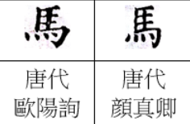

對同一時期由隸書演變而來的草書和行書有興趣的讀者可以參考[漢字形體的演變](http://writingsystemsabc.com/public/2018/12/21/漢字形體的演變/)一文的後半部分。

### 印刷體

漢字發展到宋代，木版印刷開始盛行。由於楷書有字體端正、筆劃清楚、字形易辨的優點，所以木版印刷的字體，就以楷書為藍本。但字體需要因應木版雕刻的情況，而作出適當的調整。印刷用的木版，木紋橫向。為了雕刻出耐印的字體，字的筆劃要配合木紋，因而產生有以下特色的宋體字：筆劃硬挺，橫平豎直，橫幼豎粗，起筆和收筆有棱角。

明代承接宋代的印刷術，印刷字體沿用宋體字。明代的印刷術東傳至日本，日本稱明代的印刷字體為明體，所以宋體和明體基本上是一樣的。下表列出電腦常見的漢字字體。

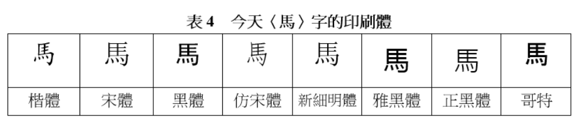

## 縱觀古今漢字

漢字的演變分為兩個重要階段：從最早形成可考文字體系的甲骨文開始，經過金文、戰國文字、大篆，一直到小篆為古漢字。接下來從隸書發展到楷書為今漢字。

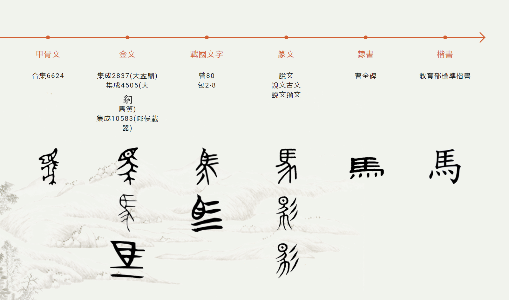

古漢字的形體和構字手段變化巨大，今漢字大部分沿襲小篆而加快其書寫速度。在整個漢字演變的過程中，文字的象形意味越來越淡化，為了減少筆畫，加快書寫。同樣重要的是，漢字的書寫和承載工具發生了翻天覆地的革新，從最初的刻寫在龜甲獸骨上的甲骨文，銘寫在青銅器上金文，用毛筆書寫在竹簡、布帛、紙張上，刻印在木板上的今文字，到現在鍵盤、語音、觸屏輸入的電子印刷體。每一次書寫媒介的更新也為漢字帶來新生，影響其形體的發展，不斷平衡文字的易識性和易寫性，爭取讓漢字既好學好認，又好寫好記。在電子輸入和記錄文字發明之前，漢字的大方向始終是寧願犧牲一些象形和易識性，也要讓漢字寫起來方便快捷。我認為在高效的電子輸入流行的今天，我們更應該注重漢字的表意和象形能力，讓漢字更加易學易認易記。這既代表著漢字形體演變的未來方向，同時也是漢字教育的前進方向。我從小接受的語文教育一開始就注重漢語拼音教育，但對漢字的構型以及造字方法極少涉及，導致學生常常死記硬背漢字而不理解每個字的含義。在後面的章節裏，我想在自己重新學習漢字的同時嘗試總結一套方便普通人學習和認識漢字的方法，希望能同大家一起客觀地瞭解漢字的優缺點，重新認識漢字。

[下一講 造字方法](./造字方法.html)

## 參考資料

[「漢字形體的演變」 ——Writing Systems](http://writingsystemsabc.com/public/2018/12/21/漢字形體的演變/)

[「中國最古老的文字——甲骨文」——Writing Systems](http://writingsystemsabc.com/public/2018/04/09/中國最古老的文字─甲骨文/)

[《漢字構型學導論》——王寧](http://61.240.26.253:84/web/downFile.aspx?id=3001351)

[「『馬』」字的漢字源流」—— 中華語文知識庫](http://www.chinese-linguipedia.org/search_source_inner.html?word=馬)